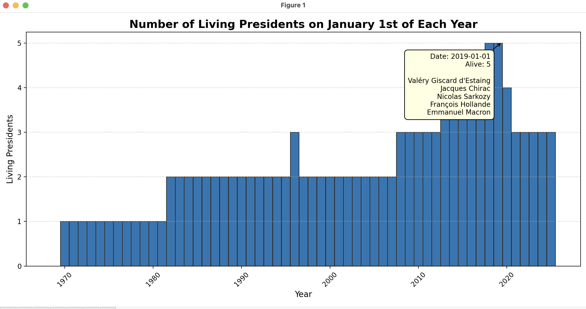

# Living Presidents Timeline Visualizer

A lightweight Python script that visualizes the number of living presidents on each January 1st over time. Ideal for visualizing historical or political data — French, American, or otherwise!

---

## What It Does

This script reads a CSV file listing presidents along with their terms and death dates, and then generates a bar chart showing how many presidents were alive on **January 1st of each year**. You can also hover over the bars to see **which presidents were alive** at that time.

---

## Example Plot

Here’s what the output looks like:

  

---

## How to Use

### 1. Prepare your CSV

Make sure your file includes at least these columns:
- `Full Name`
- `Start Date`
- `End Date`
- `Date of Death`

All date columns must be in a recognizable date format (`YYYY-MM-DD` recommended).

> The script **skips the first row** assuming it's a label/header row. Make sure your data starts from row 2.

---

### 2. Run the Script

```bash
python3 president.py your_presidents_file.csv
```

Example:

```bash
python3 president.py data/french_presidents_since_de_gaulle.csv
```

---

## Dependencies

You'll need the following Python libraries installed:

- `pandas`
- `matplotlib`
- `mplcursors`

Install them via pip if needed:

```bash
python3 -m pip install pandas matplotlib mplcursors
```

---

## 💡 Features

- Interactive bar chart
- Hover to view president names per year
- Works with any country, any era — just provide the data
- Clean, minimal codebase
